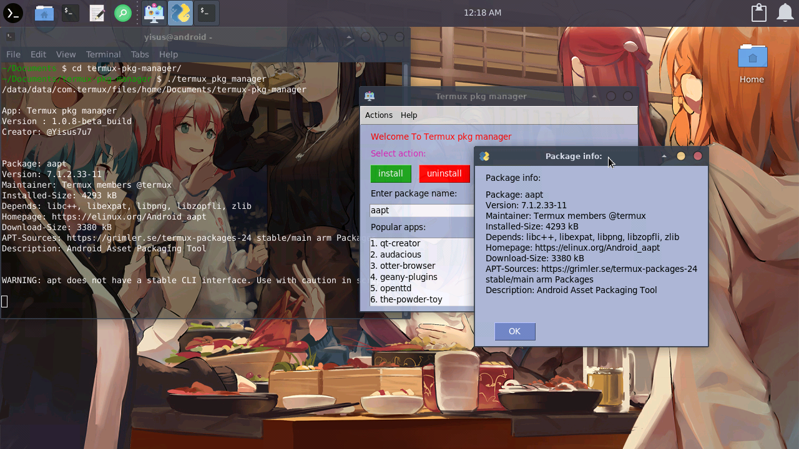
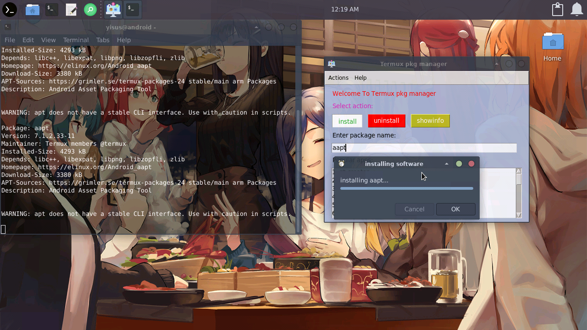
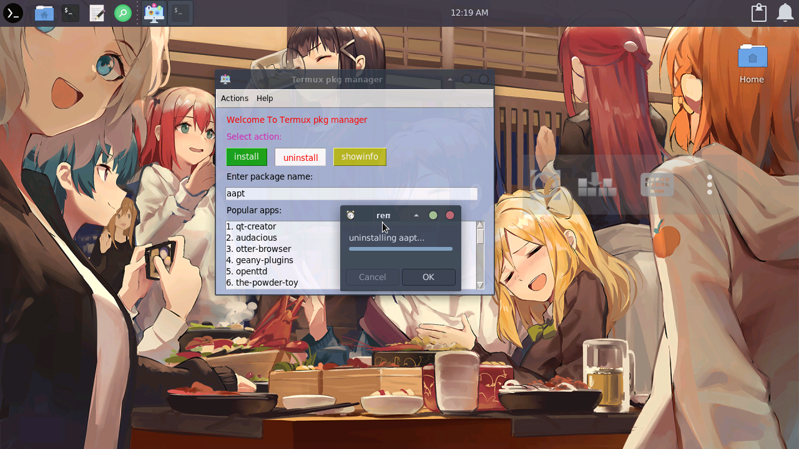
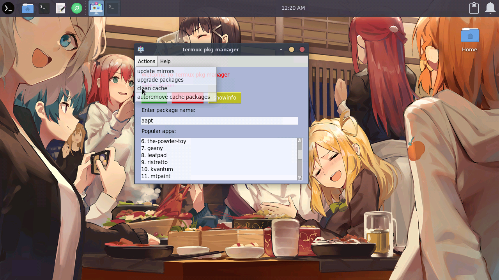

# x11-getapps
A GUI framework for pkg termux x11

Ps: this project is not finished!, but you can try the beta. 

### Requirements

```bash
pkg install python-tkinter
pip install PySimpleGUI
```

### Use 

```
./termux-pkg-manager
```

You will also need to set up a GUI in termux.

[Wiki of termux](https://wiki.termux.com/wiki/Graphical_Environment) 

[lxqt installer created by me](https://github.com/Yisus7u7/termux-desktop-lxqt) 

[xfce4 installer created by me](https://github.com/Yisus7u7/termux-desktop-xfce)

## what is termux-pkg-manager? 

termux-pkg-manager is a graphical interface for 
The termux pkg package manager.

This project is thanks to [PySimpleGUI.](https://github.com/PySimpleGUI/PySimpleGUI)

Examples and screenshots:










## Features :

- View information, install, delete a package. 

- Update list of packages and packages to their latest version. 

- Clean apt cache and remove junk packages. 

You can contribute to the project if you want, it will be appreciated. 

<div>Icons made by <a href="https://www.freepik.com" title="Freepik">Freepik</a> from <a href="https://www.flaticon.com/" title="Flaticon">www.flaticon.com</a></div>
